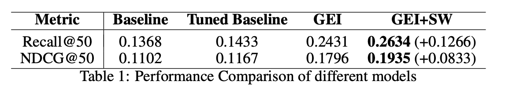

# DEEP SOCIAL RECOMMENDATION WITH IMPLICIT FEEDBACK

As the amount of information available on the web grows rapidly in recent decade, recommender system becomes an inevitable approach to avoid providing users with contents that are not of their interest across a variety of web domains. In this project, We use [`Bayesian Personalized Ranking`](https://arxiv.org/pdf/1205.2618.pdf) method for implicit feedback as our baseline model which is only based on user-item interactions. To incorporate social network with recommender system, we add social weights which represents the effect of friends on users. To further improve the model, we use `node2vec` to initialize the weights of the embeddings. Detailed information can be found in [`paper.pdf`](./paper.pdf)

# Dataset 
The experiment is done on Yelp dataset and is included in `Data` folder. Yelp is an online social media platform with reviews for local businesses and a social network linking users. We will be focusing on a subset of the dataset, limited to a single state (Arizona) in the United States. 

# Experiment

We first train the baseline model with default parameters (embed_dim=64, batch_size=1024). Then, we try our best to tune the parameters (embed_dim=256, batch_size=256). Afterwards, we use node2vec initialization without social weight, denoted as `GEI` (graph embedding initialization). Finally, we add social weights to incorporate the social network information, denoted as `GEI+SW` (graph embedding initialization with social weight). The model is trained with around 50 epochs. For Adam optimizer, learning_rate is reduced from 0.0001 to 0.00001 after epoch 15 and weight_decay is reduced from 0.0001 to 0 after epoch 35. The experiments are done on Google Colab with GPU and the approximate training time of final model is 30 minutes. The results are illustrated 

# Result
For the project, we will use Recall@50 and NDCG@50 as the performance metrics. Our result shows that adding social weights does improve the performance of the model. Social information really helps to make better recommendations in this case. Our proposed model is able to encode the social
information by assigning weights which illustrates the user-user interactions. Hence, we can outperform the standard non-social baseline model.

